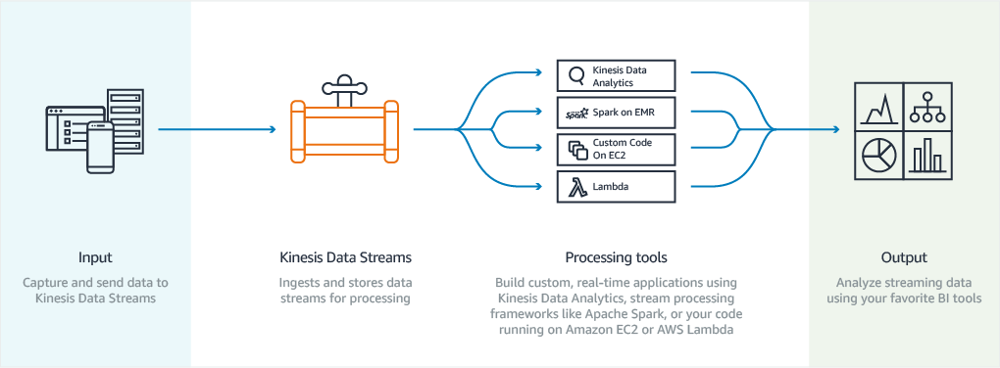

# Data Scientist

## Databases: [Big Data](https://www.techopedia.com/definition/27745/big-data) Introduction

Big data refers to a process that is used when traditional data mining and handling techniques cannot uncover the insights and meaning of the underlying data. Data that is unstructured or time sensitive or simply very large cannot be processed by relational database engines. This type of data requires a different processing approach called big data, which uses massive parallelism on readily-available hardware.

Topics related to Big Data include:

- Analytics
- Architecture
- High Performance Computing
- Streaming Data
- Visualization

## Databases: Big Data General

ig data can be described in terms of data management challenges that – due to increasing volume, velocity and variety of data – cannot be solved with traditional databases. While there are plenty of definitions for big data, most of them include the concept of what’s commonly known as the “three V’s” of big data:

- Volume: Ranges from terabytes to petabytes of data
- Variety: Includes data from a wide range of sources and formats (e.g. web logs, social media interactions, ecommerce and online transactions, financial transactions, etc)
- Velocity: Increasingly, businesses have stringent requirements from the time data is generated, to the time actionable insights are delivered to the users. Therefore, data needs to be collected, stored, processed, and analyzed within relatively short windows – ranging from daily to real-time.

___[Getting Started](https://www.youtube.com/watch?v=08G9NfDETVE&feature=youtu.be)___

## Databases: Big Data Analytics

- [Data Analysis](https://www.udacity.com/course/intro-to-data-analysis--ud170)
- [Data Science](https://www.udacity.com/course/intro-to-data-science--ud359)
- [BDA on AWS](https://d0.awsstatic.com/whitepapers/Big_Data_Analytics_Options_on_AWS.pdf)
- [Project](https://aws.amazon.com/getting-started/projects/analyze-big-data/)

## Databases: [Big Data Architecture](https://youtu.be/jKCj4BxGTi8)

- [Big Data Architectural Patterns and Best Practices on AWS](https://www.youtube.com/watch?v=a3713oGB6Zk)
- [Architectural Patterns for Big Data on AWS](https://youtu.be/sOeciPNtsoc)
- [Building a Modern Data Architecture](https://www.youtube.com/watch?v=RYpQ1BTmV_o)

## Databases: Big Data and HPC

High Performance Computing (HPC) allows scientists and engineers to solve complex, compute-intensive problems. HPC applications often require high network performance, fast storage, large amounts of memory, very high compute capabilities, or all of these. AWS enables you to increase the speed of research and reduce time-to-results by running HPC in the cloud and scaling to larger numbers of parallel tasks than would be practical in most on-premises environments. AWS helps to reduce costs by providing CPU, GPU, and FPGA servers on-demand, optimized for specific applications, and without the need for large capital investments.

### ANALYZING BIG DATA WITH HADOOP

- [BD and Hadoop](https://www.udemy.com/big-data-and-hadoop-essentials-free-tutorial/learn/v4/overview)
- [Analyzing BD with Amazon EMR](https://aws.amazon.com/getting-started/projects/analyze-big-data/)
- [Intro to Hadoop annd MapReduce](https://www.udacity.com/course/intro-to-hadoop-and-mapreduce--ud617)
- [Hadoop in Cloud](https://s3-us-west-2.amazonaws.com/content.aws/AWS+Slideshare_Hadoop-in-the-cloud-unlock-potential-of-big-data-on-aws.pdf)
- [Apache Hadoop on Amazon EMR](https://aws.amazon.com/emr/details/hadoop)

## Databases: Big Data and Visualization

### Data Visualisation

Visualisation charts convey one of the following types of information: Key Performance Indicators (KPI), Relationships, Comparisons, Distributions,and Compositions.

#### KEY PERFORMANCE INDICATORS (KPIs)

A KPI is usually a single value that relates to a particular area or function and is a reflection of how well you are doing in that area or function. This varies from business to business and function to function. Here are some popular KPIs that companies like to track:

- Net Promoter Score (NPS): How likely is it for a customer to recommend your product or service to a friend?
- Customer Profitability Score (CPS): How much profit does a customer bring to your business after deducting customer acquisition and customer retention costs?
- Conversion Rate: How many leads get converted to customers?
- Relative Market Share: How big is your slice of the pie compared to your competitors in the market?
- Net Profit Margin: The percent of your revenue which is net profit.

KPIs are best represented using KPI charts.

#### Relationships

You are trying to either establish or prove whether a relationship exists between 2 or more variables. As shown in the table below, the chart type that is best suited for your data would depend on the number of variables you need to use.

- Scatter Chart
- Bubble Chart

#### Comparisons

You are trying to show or examine how different variables change over time or provide a static snapshot of how different variables compare. The type of chart you choose would depend on the number of variables you need to use.

- Bar Chart
- Table
- Column Chart
- Line Chart

#### Distributions

As the name suggests, you are trying to show how your data is distributed over certain intervals. In distribution data, intervals implies clustering or grouping of data, and not time.

- Column Histrogram
- Scatter Chart

#### Compositions

This is when you want to highlight the various elements that make up your data - in other words, its composition. Your first choice is whether your data is static or if it is changing over time.

- Pie Chart
- Stacked 100% Pie Chart
- Tree Map
- Stacked Area Chart
- Stacked 100% Area Chart
- Stacked Column Chart
- Stacked 100% Column Chart

### [Project: Amazon Kinesis Data Visualisation Sample App](https://github.com/awslabs/amazon-kinesis-data-visualization-sample)

## Databases: Big Data and Streaming

### Data Streaming

Data streaming is the process of transferring a stream of data from one place to another, to a sender and recipient or through some network trajectory.

Data streaming is applied in multiple ways with various protocols and tools that help provide security, efficient delivery and other data results. Streaming data is data that is generated continuously by thousands of data sources,which typically send in the data records simultaneously, and in small sizes (order of Kilobytes). Streaming data includes a wide variety of data such as log files generated by customers using your mobile or web applications, ecommerce purchases, in-game player activity, information from social networks, financial trading floors,or geospatial services, and telemetry from connected devices or instrumentation in data centers.

### Comparison between Batch Processing and Stream Processing

Before dealing with streaming data, it is worth comparing and contrasting stream processing and batch processing. Batch processing can be used to compute arbitrary queries over different sets of data. It usually computes results that are derived from all the data it encompasses, and enables deep analysis of big data sets. MapReduce-based systems, like Amazon EMR, are examples of platforms that support batch jobs. In contrast, stream processing requires ingesting a sequence of data, and incrementally updating metrics, reports, and summary statistics in response to each arriving data record. It is better suited for real-time monitoring and response functions.

- [What is Data Stream ?](https://www.coursera.org/lecture/big-data-management/what-is-a-data-stream-BNQkJ)

### DataStream in Cloud

- [What is Streaming D](https://aws.amazon.com/streaming-data)
- [AWS Kinesis DS](https://docs.aws.amazon.com/streams/latest/dev/introduction.html)
- [Basic Stream Operations](http://docs.aws.amazon.com/streams/latest/dev/fundamental-stream.html)
- [Creating Stream](http://docs.aws.amazon.com/streams/latest/dev/kinesis-using-sdk-java-create-stream.html)

### Tutorial and Hands-On

- [Visualizing Web Traffic](https://docs.aws.amazon.com/streams/latest/dev/kinesis-sample-application.html)
- [Kinesis and AWS CLI](https://docs.aws.amazon.com/streams/latest/dev/kinesis-tutorial-cli.html)
- [Real Time Stock Data](https://docs.aws.amazon.com/streams/latest/dev/kinesis-tutorial-cli.html)

## Databases: Data Warehouses and Lakes

A data warehouse is a collection of corporate information and data derived from operational systems and external data sources. A data warehouse is designed to support business decisions by allowing data consolidation, analysis and reporting at different aggregate levels. Data is populated into the DW through the processes of extraction, transformation and loading.

A data lake is a storage repository that holds a vast amount of raw data in its native format until it is needed. While a hierarchical data warehouse stores data in files or folders, a data lake uses a flat architecture to store data.

- [About Data Warehouse](https://aws.amazon.com/data-warehouse/)
- [About Data Lakes](https://aws.amazon.com/big-data/what-is-a-data-lake)
- [PBL-Build a Data Warehouse](http://docs.aws.amazon.com/redshift/latest/gsg/getting-started.html)

Unlike a data warehouse, a data lake is a centralized repository for all data, including structured and unstructured. A data warehouse utilizes a pre-defined schema optimized for analytics. In a data lake, the schema is not defined, enabling additional types of analytics like big data analytics, full text search, real-time analytics, and machine learning. See the comparison chart below for more details

## Databases: Non-relational

A non-relational database is a database that does not incorporate the table/key model that relational database management systems (RDBMS) promote. These kinds of databases require data manipulation techniques and processes designed to provide solutions to big data problems that big companies face.

- [RDMS vs NoSQL](https://www.youtube.com/watch?v=VN7P8B33RP8)
- [MongoDB on AWS](https://docs.aws.amazon.com/quickstart/latest/mongodb/welcome.html)

## Databases: Relational

A relational database (RDB) is a collective set of multiple data sets organized by tables, records and columns. RDBs establish a well-defined relationship between database tables. Tables communicate and share information, which facilitates data searchability, organization and reporting. RDBs use Structured Query Language (SQL), which is a standard user application that provides an easy programming interface for database interaction. RDB is derived from the mathematical function concept of mapping data sets and was developed by Edgar F. Codd.

- [Intro to RDMS](https://www.udacity.com/course/intro-to-relational-databases--ud197)
- [DBS Tasks for mysql](http://docs.aws.amazon.com/AmazonRDS/latest/UserGuide/Appendix.MySQL.CommonDBATasks.html)
- [Creating MySQL DB Instance AWS](http://docs.aws.amazon.com/AmazonRDS/latest/UserGuide/CHAP_GettingStarted.CreatingConnecting.MySQL.html)
- [Oracle DB](http://docs.aws.amazon.com/AmazonRDS/latest/UserGuide/CHAP_GettingStarted.CreatingConnecting.Oracle.html)
- [Microsoft SQL](http://docs.aws.amazon.com/AmazonRDS/latest/UserGuide/CHAP_GettingStarted.CreatingConnecting.SQLServer.html)
- [Deleting a DB instance](http://docs.aws.amazon.com/AmazonRDS/latest/UserGuide/CHAP_GettingStarted.CreatingConnecting.Oracle.html#CHAP_GettingStarted.Deleting.Oracle)
- [WebServer and Amazon RDS Server](http://docs.aws.amazon.com/AmazonRDS/latest/UserGuide/TUT_WebAppWithRDS.html)
- [Intro to Microsoft SQL Server](https://youtu.be/K8gSaS_E4JM)

## Software Development: General

- [Software Architecture](https://www.coursera.org/learn/software-architecture)
- [Software Development Processes and Methodologies: Definition](https://www.coursera.org/lecture/software-processes/software-architecture-definition-gkXeB)
- [https://www.udacity.com/course/software-architecture-design--ud821](https://www.udacity.com/course/software-architecture-design--ud821)

## Platform: General

A platform is a group of technologies that are used as a base upon which other applications, processes or technologies are developed. In personal computing, a platform is the basic hardware (computer) and software (operating system) on which software applications can be run.

- Operating Systems
- Virtualisation

## Platform: Operating Systems

An operating system (OS), in its most general sense, is software that allows a user to run other applications on a computing device. While it is possible for a software application to interface directly with hardware, the vast majority of applications are written for an OS, which allows them to take advantage of common libraries and not worry about specific hardware details.

- [Introduction to OS](https://www.udacity.com/course/introduction-to-operating-systems--ud923)
- [Linux CLI](https://www.udacity.com/course/linux-command-line-basics--ud595)
- [Linux Web Servers](https://www.udacity.com/course/configuring-linux-web-servers--ud299)

### How are Operating Systems used in the cloud

One example is by using Amazon EC2. This service presents a true virtual computing environment, allowing you to use web service interfaces to launch instances with a variety of operating systems, load them with your custom application environment, manage your network’s access permissions, and run your image using as many or few systems as you desire.

- [AWS EC2](https://aws.amazon.com/ec2/details/)
- [Finding Linux AMI](https://docs.aws.amazon.com/AWSEC2/latest/UserGuide/finding-an-ami.html)
- [Windows AMI](https://docs.aws.amazon.com/AWSEC2/latest/WindowsGuide/ec2-windows-instances.html)
- [Troubleshoot](https://aws.amazon.com/premiumsupport/knowledge-center/ec2-linux-ssh-troubleshooting/)
- [PBL: Hosting Wordpress on AWS EC2](https://docs.aws.amazon.com/AWSEC2/latest/UserGuide/hosting-wordpress.html)

## Platform: Virtualization

Virtualization refers to the creation of a virtual resource such as a server, desktop, operating systems, file, storage or network. The main goal of virtualization is to manage workloads by radically transforming traditional computing to make it more scalable. Virtualization has been a part of the IT landscape for decades now, and today it can be applied to a wide range of system layers including operating system-level virtualization, hardware-level virtualization and server virtualization.

### How is virtualization used in the cloud

Virtualization is software that manipulates hardware, while cloud computing refers to a service that results from that manipulation. You can't have cloud computing without virtualization.

VMware is an example of platform virtualization software.

- [PBL: Launching a Linux VM](https://aws.amazon.com/getting-started/tutorials/launch-a-virtual-machine/)
- [AWS and VMware](https://youtu.be/CDSutis_AfA)
- [VM Import/Export](https://docs.aws.amazon.com/vm-import/latest/userguide/what-is-vmimport.html)
- [How VM Import/Export works](https://docs.aws.amazon.com/vm-import/latest/userguide/what-is-vmimport.html)
- [AWS Containers](https://aws.amazon.com/what-are-containers/)
- [EC2 Reserved Instances](https://aws.amazon.com/premiumsupport/knowledge-center/ec2-ri-basics/)
