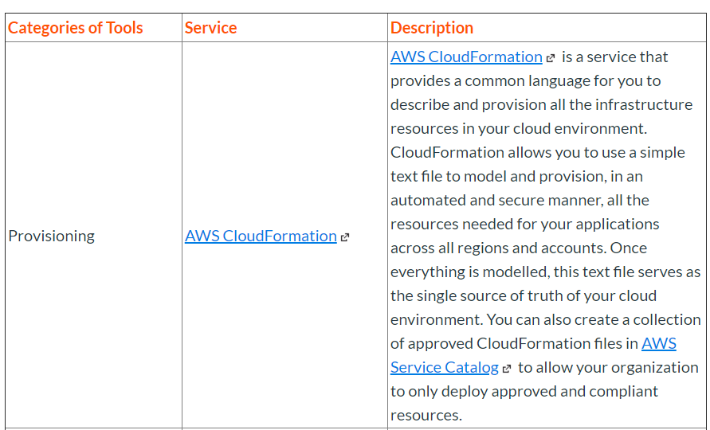
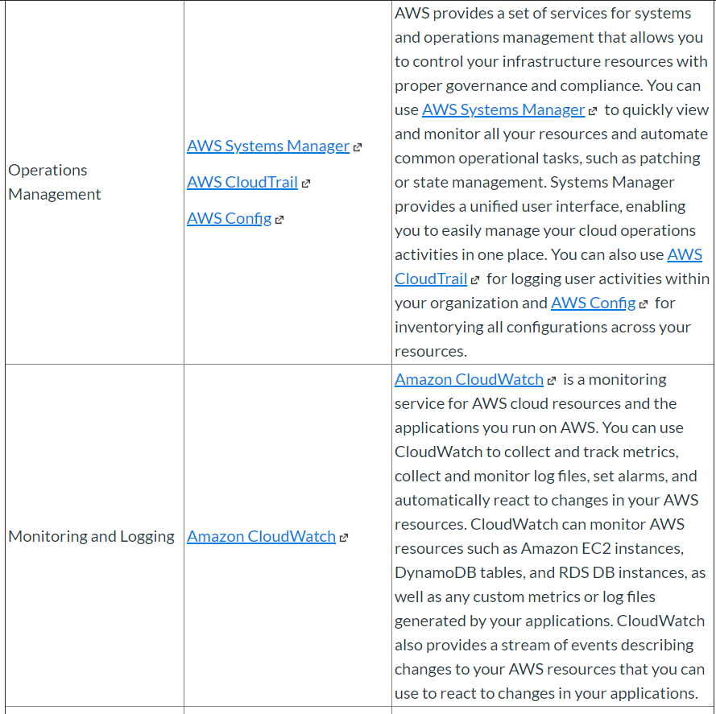
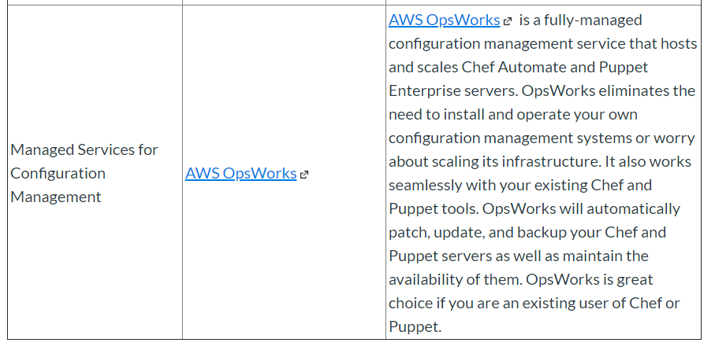
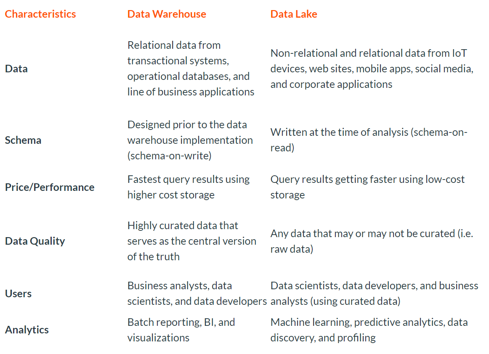

# AWS Solutions Architect

## Software Development: General

- [Software Architecture](https://www.coursera.org/learn/software-architecture)
- [Software Development Processes and Methodologies: Definition](https://www.coursera.org/lecture/software-processes/software-architecture-definition-gkXeB)
- [https://www.udacity.com/course/software-architecture-design--ud821](https://www.udacity.com/course/software-architecture-design--ud821)

## Software Development: DevOps

DevOps is the combination of cultural philosophies, practices, and tools that increases an organization’s ability to deliver applications and services at high velocity: evolving and improving products at a faster pace than organizations using traditional software development and infrastructure management processes. This speed enables organizations to better serve their customers and compete more effectively in the market.

### Continuous Integration

Continuous integration (Links to an external site.) is a DevOps software development practice where developers regularly merge their code changes into a central repository, after which automated builds and tests are run. Continuous integration most often refers to the build or integration stage of the software release process and entails both an automation component (e.g. a CI or build service) and a cultural component (e.g. learning to integrate frequently). The key goals of continuous integration are to find and address bugs quicker, improve software quality, and reduce the time it takes to validate and release new software updates.

### Continuos Delievry

Continuous delivery (Links to an external site.) is a DevOps software development practice where code changes are automatically built, tested, and prepared for a release to production. It expands upon continuous integration by deploying all code changes to a testing environment and/or a production environment after the build stage. When continuous delivery is implemented properly, developers will always have a deployment-ready build artifact that has passed through a standardized test process.

Continuous delivery lets developers automate testing beyond just unit tests so they can verify application updates across multiple dimensions before deploying to customers. These tests may include UI testing, load testing, integration testing, API reliability testing, etc. This helps developers more thoroughly validate updates and pre-emptively discover issues. With the cloud, it is easy and cost-effective to automate the creation and replication of multiple environments for testing, which was previously difficult to do on-premises.

- [Developing on AWS](https://aws.amazon.com/training/course-descriptions/developing)

## Software Development: DevOps Blue/Green

A blue/green deployment is a change management strategy for releasing software code. Blue/green deployments, which may also be referred to as A/B deployments require two identical hardware environments that are configured exactly the same way. While one environment is active and serving end users, the other environment remains idle.

Blue/green deployments are often used for consumer-facing applications and applications with critical uptime requirements. New code is released to the inactive environment, where it is thoroughly tested. Once the code has been vetted, the team makes the idle environment active, typically by adjusting a router configuration to redirect application program traffic. The process reverses when the next software iteration is ready for release.

- [Blue/Green on AWS](https://aws.amazon.com/quickstart/architecture/blue-green-deployment)
- [Quick Start Guide: Blue-Green Deployments to AWS Elastic Beanstalk on the AWS Cloud](https://aws-quickstart.s3.amazonaws.com/quickstart-codepipeline-bluegreen-deployment/doc/blue-green-deployments-to-aws-elastic-beanstalk-on-the-aws-cloud.pdf)
- [PBL: Deploy Code to a VM](https://aws.amazon.com/getting-started/tutorials/deploy-code-vm/?trk=gs_card)
- [Lauch a Web App](https://aws.amazon.com/getting-started/tutorials/launch-an-app)

## Software Development: Infrastructure as Code

## Databases: Non-relational

A non-relational database is a database that does not incorporate the table/key model that relational database management systems (RDBMS) promote. These kinds of databases require data manipulation techniques and processes designed to provide solutions to big data problems that big companies face.

- [RDMS vs NoSQL](https://www.youtube.com/watch?v=VN7P8B33RP8)
- [MongoDB on AWS](https://docs.aws.amazon.com/quickstart/latest/mongodb/welcome.html)

## Databases: Relational

A relational database (RDB) is a collective set of multiple data sets organized by tables, records and columns. RDBs establish a well-defined relationship between database tables. Tables communicate and share information, which facilitates data searchability, organization and reporting. RDBs use Structured Query Language (SQL), which is a standard user application that provides an easy programming interface for database interaction. RDB is derived from the mathematical function concept of mapping data sets and was developed by Edgar F. Codd.

- [Intro to RDMS](https://www.udacity.com/course/intro-to-relational-databases--ud197)
- [DBS Tasks for mysql](http://docs.aws.amazon.com/AmazonRDS/latest/UserGuide/Appendix.MySQL.CommonDBATasks.html)
- [Creating MySQL DB Instance AWS](http://docs.aws.amazon.com/AmazonRDS/latest/UserGuide/CHAP_GettingStarted.CreatingConnecting.MySQL.html)
- [Oracle DB](http://docs.aws.amazon.com/AmazonRDS/latest/UserGuide/CHAP_GettingStarted.CreatingConnecting.Oracle.html)
- [Microsoft SQL](http://docs.aws.amazon.com/AmazonRDS/latest/UserGuide/CHAP_GettingStarted.CreatingConnecting.SQLServer.html)
- [Deleting a DB instance](http://docs.aws.amazon.com/AmazonRDS/latest/UserGuide/CHAP_GettingStarted.CreatingConnecting.Oracle.html#CHAP_GettingStarted.Deleting.Oracle)
- [WebServer and Amazon RDS Server](http://docs.aws.amazon.com/AmazonRDS/latest/UserGuide/TUT_WebAppWithRDS.html)
- [Intro to Microsoft SQL Server](https://youtu.be/K8gSaS_E4JM)

## Databases: Data Management and Data Migration

### Data Management

A database management system (DBMS) is system software for creating and managing databases. The DBMS provides users and programmers with a systematic way to create, retrieve, update and manage data.

- [Core](https://www.coursera.org/learn/core-database)
- [Essentials](https://www.coursera.org/learn/database-management)

### Data Migration

Data migration is the process of transporting data between computers, storage devices or formats. It is a key consideration for any system implementation, upgrade or consolidation.

The AWS Schema Conversion Tool (Links to an external site.) makes heterogeneous database migrations predictable by automatically converting the source database schema and a majority of the database code objects, including views, stored procedures, and functions, to a format compatible with the target database.

## Databases: Data Warehouses and Lakes

A data warehouse is a collection of corporate information and data derived from operational systems and external data sources. A data warehouse is designed to support business decisions by allowing data consolidation, analysis and reporting at different aggregate levels. Data is populated into the DW through the processes of extraction, transformation and loading.

A data lake is a storage repository that holds a vast amount of raw data in its native format until it is needed. While a hierarchical data warehouse stores data in files or folders, a data lake uses a flat architecture to store data.

- [About Data Warehouse](https://aws.amazon.com/data-warehouse/)
- [About Data Lakes](https://aws.amazon.com/big-data/what-is-a-data-lake)
- [PBL-Build a Data Warehouse](http://docs.aws.amazon.com/redshift/latest/gsg/getting-started.html)

Unlike a data warehouse, a data lake is a centralized repository for all data, including structured and unstructured. A data warehouse utilizes a pre-defined schema optimized for analytics. In a data lake, the schema is not defined, enabling additional types of analytics like big data analytics, full text search, real-time analytics, and machine learning. See the comparison chart below for more details

## Network: Introduction

A computer network is a group of computer systems and other computing hardware devices that are linked together through communication channels to facilitate communication and resource-sharing among a wide range of users. Networks are commonly categorized based on their characteristics.
Topics related to networking include:

- Architecture and Troubleshooting
- Infrastructure Provisioning
- Directory Services

## Network: Architecture

Network Architecture is the complete framework of an organization's computer network. The diagram of the network architecture provides a full picture of the established network with detailed view of all the resources accessible. It includes hardware components used for communication, cabling and device types, network layout and topologies, physical and wireless connections, implemented areas and future plans. In addition, the software rules and protocols also constitute to the network architecture. This architecture is always designed by a network manager/administrator with coordination of network engineers and other design engineers.

- [What is Internetworking](https://www.youtube.com/watch?v=369eeG83lRo)
- [Computer Networking](https://www.udacity.com/course/computer-networking--ud436)
- [TCP and IP](https://www.coursera.org/learn/tcpip#about)

### Architecture

Network Architecture is the complete framework of an organization's computer network. The diagram of the network architecture provides a full picture of the established network with detailed view of all the resources accessible. It includes hardware components used for communication, cabling and device types, network layout and topologies, physical and wireless connections, implemented areas and future plans. In addition, the software rules and protocols also constitute to the network architecture. This architecture is always designed by a network manager/administrator with coordination of network engineers and other design engineers.

Cloud computing architecture refers to the components and subcomponents required for cloud computing. These components typically consist of a front end platform (fat client, thin client, mobile device), back end platforms (servers, storage), a cloud based delivery, and a network (Internet, Intranet, Intercloud).
Cloud services can be delivered publicly or privately using the internet and can also remain within a company’s network when delivered over an intranet. Sometimes, organizations make use of a combination of both.

No matter where the actual “cloud” is—a company’s own data center or a service provider’s data center, cloud computing uses networking to enable convenient, on-demand access to a shared pool of computing resources like networks, storage, servers, services, and applications. By using virtualization, these assets can be provisioned and released quickly and easily as necessary.

Because of technology like virtualization and hypervisors, it’s possible for many virtual servers to exist on a single physical server. These technologies power other cloud subscriptions like Platform-as-a-Service (PaaS), Infrastructure-as-a-Service (IaaS), and more.

### Front End Platform

Front-end is the side that is visible to the client, customer, or user. Front-end pieces include the user interface, and the client’s computer system or network that is used for accessing the cloud system.

### Back End Platform

The back-end pieces are on the side used by the service provider. These include various servers, computers, data storage systems, virtual machines, and programs that together constitute the cloud of computing services. The back-end side also is responsible for providing security mechanisms, traffic control and protocols that connect networked computers for communication.

### Cloud Based Platform

Cloud computing services are everywhere these days. For example, if you use QuickBooks for your accounting, or Expedia to schedule your travel, or Netflix to watch you favorite series, you’re a cloud computing user. These are all examples of subscriptions a company or individual can purchase that enable them to use the software, typically known as Software-as-a-Service, or SaaS.

- [Amazon VPC](http://docs.aws.amazon.com/AmazonVPC/latest/UserGuide/VPC_Introduction.html)
- [Modular Virtual Network](http://docs.aws.amazon.com/quickstart/latest/vpc/welcome.html)
- [Security of VPC](http://docs.aws.amazon.com/AmazonVPC/latest/UserGuide/VPC_Security.html)
- [VPC and Subnet Basics](http://docs.aws.amazon.com/AmazonVPC/latest/UserGuide/VPC_Subnets.html)
- [Log Analysis AWS](http://media.amazonwebservices.com/architecturecenter/AWS_ac_ra_loganalysis_11.pdf)
- [Log Analysis](http://media.amazonwebservices.com/architecturecenter/AWS_ac_ra_loganalysis_11.pdf)
- [VPC Peering](http://docs.aws.amazon.com/AmazonVPC/latest/PeeringGuide/Welcome.html)
- [Configure Proxy Protocol Support](http://docs.aws.amazon.com/ElasticLoadBalancing/latest/DeveloperGuide/enable-proxy-protocol.html)
- [Cloud Data Back Up](https://aws.amazon.com/getting-started/projects/backup-data-to-cloud/)
- [PBL: Building Amazon VPC](https://run.qwiklab.com/focuses/359?parent=catalog)
- [PBL: Configuring AWS ELB Policy for Proxy Protocol AWS](https://gist.github.com/pablitoc/91c40d820f207879969c)
- [PBL: Compute and Networking](https://qwiklabs.com/quests/6?locale=en)

## Network Provisioning

Provisioning is the enterprise-wide configuration, deployment and management of multiple types of IT system resources. An organization's IT or HR department oversees the provisioning process, which is applied to monitor user and customer access rights and privacy while ensuring enterprise resource security.

- [Differences between Windows Server and an Amazon EC2 Windows Instance](http://docs.aws.amazon.com/AWSEC2/latest/WindowsGuide/EC2Win_Infrastructure.html#EC2InstanceAndWindowsServer)
- [Build a SharePoint Server Farm](https://aws.amazon.com/getting-started/projects/launch-lamp-web-app)
- [Provision Desktops in the Cloud](https://aws.amazon.com/getting-started/projects/provision-cloud-desktops)
- [AWS CloudFormation Templates](https://aws.amazon.com/cloudformation/aws-cloudformation-templates)
- [PBL: Introduction to AWS CloudFormation](https://qwiklabs.com/focuses/383?locale=en&parent=catalog)

## Network: Directory Service

Directory services are software systems that store, organize and provide access to directory information in order to unify network resources. Directory services map the network names of network resources to network addresses and define a naming structure for networks.

The directory service provides transparency to protocols and network topology, permitting users to access resources without having to be aware of the physical location of the devices. It’s an important component of the network operating system and is a central information repository for a service delivery platform.

- [AWS Directory Service](https://aws.amazon.com/directoryservice)
- [Boot an EC2 Windows Instance into Directory Services Restore Mode (DSRM)](http://docs.aws.amazon.com/AWSEC2/latest/WindowsGuide/common-issues.html#boot-dsrm)
- [Active Directory Domain Services on the AWS Cloud](http://docs.aws.amazon.com/quickstart/latest/active-directory-ds/welcome.html)
- [AWS Directory Service User Guide](https://docs.aws.amazon.com/directoryservice/latest/admin-guide/what_is.html)
- [Troubleshooting AWS Directory Service Administration Issues](http://docs.aws.amazon.com/directoryservice/latest/admin-guide/admin_troubleshooting.html)
